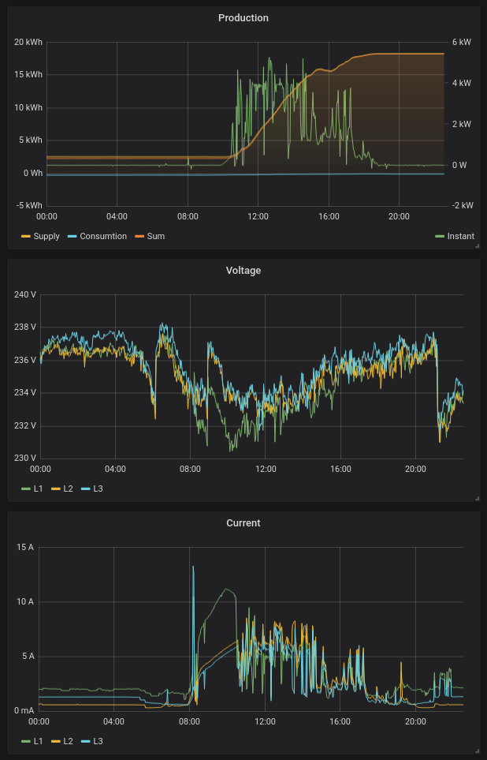

# Prometheus Exporter for SMA Home Manager

This project exports values from the SMA Home Manager for use in Prometheus / Grafana.



## Getting Started

You can download a build from the [release page](https://github.com/dr0ps/sma_exporter/releases/latest). When run the executable it will create a http server running on port 9743 where it exports all data for supplied and consumed power, voltage and frequency as gauges and, where available, as counters. The part that reads the SMA data is basically copied from [SMA-EM](https://github.com/datenschuft/SMA-EM).

### Building from Source

You need a Rust/Cargo installation. See https://rustup.rs/. After checking out this repository you can simply run

```
cargo run
```

and if that works for you (point your browser to http://localhost:9743) you can install the binary.

## Deployment

Deployment is dependent on your needs. On a linux machine you will probably want to run this as a service.

Relevant values scraped by Prometheus:

```
Gauges (current values):
smahomemanager_real_supplied_watts (for three phases and total)
smahomemanager_real_consumed_watts (for three phases and total)
smahomemanager_voltage_millivolts (for three phases)
smahomemanager_current_milliamperes (for three phases)
smahomemanager_frequency_millihertz (total)

Counters (accumulating values):
smahomemanager_real_supplied_watthours (for three phases and total)
smahomemanager_real_consumed_watthours (for three phases and total)


```


## Authors

See the list of [contributors](https://github.com/dr0ps/sma_exporter/contributors) who participated in this project.

## License

This project is licensed under the GNU GENERAL PUBLIC LICENSE, Version 2 - see the [LICENSE](LICENSE) file for details

## Acknowledgments

Based on SMA-EM by **Wenger Florian** - [SMA-EM](https://github.com/datenschuft/SMA-EM)

